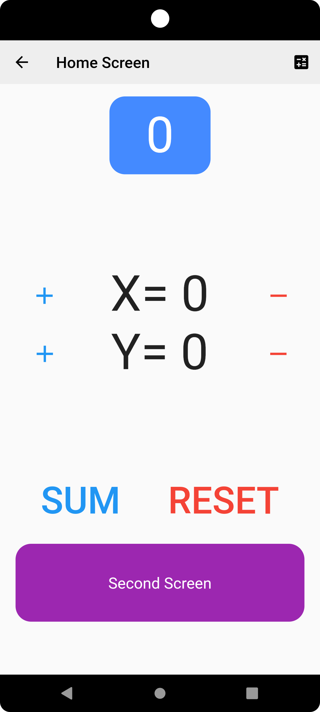
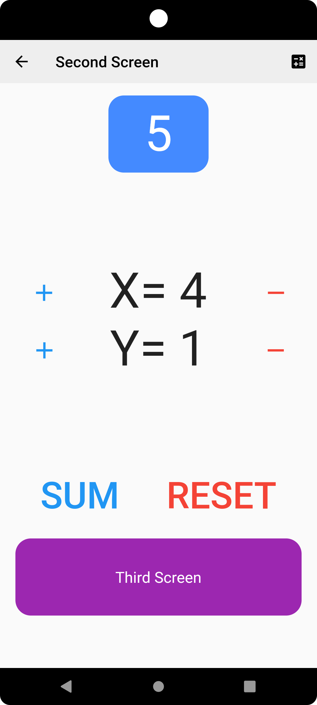
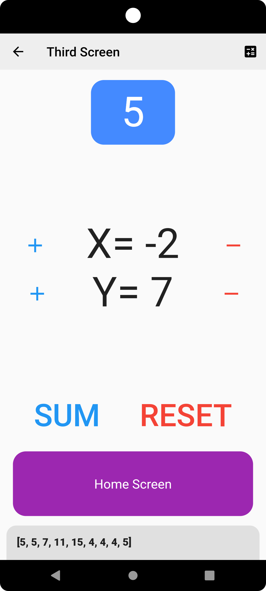

# Hello Get

## Some Hi-Hello with Get, Flutter's No. 1 most liked package.
- In this practice project, I created a counter app that increase, decrease, reset and add X and Y value.
- Int, RxInt and RxList data type is used
- Sum button adds current X and Y value and shows it on top
- It also adds the sum value in a list(RxList)
- The list can be shown by a snackbar, which appears on clicking the calculate button on right top
- The Reset button resets X, Y and list
- All value's are passed through different screens

## Showcase

<table>
  <tr>
    <td>Home Screen</td>
    <td>Second Screen</td>
    <td>Third Screen</td>
  </tr>
  <tr>
    <td></td>
    <td></td>
    <td></td>
  </tr>
 </table>
<br/>

## Stacks

- Dart
- Flutter


## topics covered briefely

- State management
- Navigation
- Dependency Injection


## Q&A

```

```
## Packages
- [get](https://pub.dev/packages/get)


